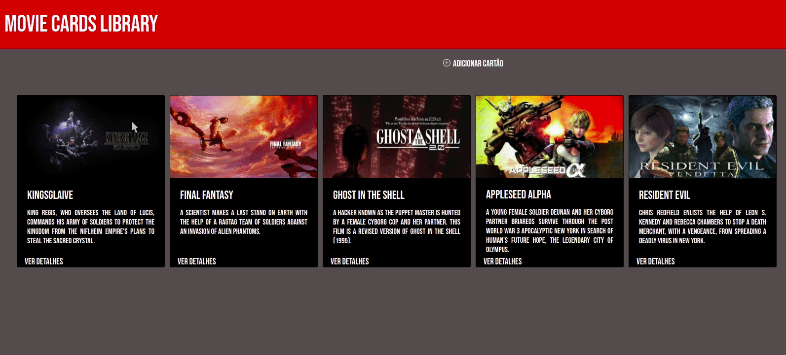

<h1 align="center">
    
</h1>

## **SOBRE**
Projeto com lista de cards de filmes, criado no módulo **FrontEnd** na **Trybe** para praticar CRUD.
Nele é possível Criar um novo Card, Ler os detalhes, Editar e também excluir o Card.

---

### **HABILIDADES**
  
- Utilizar o componentDidMount para executar uma ação após o componente ser inserido no DOM;
- Utilizar o shouldComponentUpdate para avaliar se uma atualização do componente deve ou não acontecer naquele momento;
- Utilizar o componentDidUpdate para executar uma ação após o componente ser atualizado;
- Utilizar o componentWillUnmount para realizar uma ação antes de o componente ser desmontado;
- Utilizar o props.children para acessar os filhos de um componente React e interagir com eles;
- Utilizar o componente BrowserRouter corretamente;
- Criar links de navegação na aplicação com o componente Link ;
- Criar rotas, mapeando o caminho da URL com o componente correspondente, via Route ;
- Estruturar e organizar as rotas da sua aplicação com o componente Switch ;
- Usar o componente Redirect pra alternar entre rotas.

  ---
  

### **TECNOLOGIAS UTILIZADAS**
- ReactJS
- React Router
- CSS
- Linter

---


### **COMO RODAR O PROJETO**

## 1 Faça o clone do repositório ##
```
git clone git@github.com:alexandremolive/project-movie-card-CRUD.git
```

## 2 Execute os comandos abaixo ##

```
yarn add
npm install
```
```
yarn start
npm start
```


